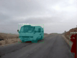

# Instance As Identity: A Generic Online Paradigm for Video Instance Segmentation

## Introduction

This repo is the official implementation of IAI paradigm for video instance segmentation. The overview of IAI paradigm is shown below. 


## Visualization on YTVIS-2019 & OVIS dataset

 

## Performance

|  Dataset  |  Model Name  | Backbone | mAP  | FPS | FPS (4GPUs) |
| --------- | ------------ | -------- | ---- | --- | ----------- |
| YTVIS2019 | IAI+CondInst |   R50    | 39.9 | 32  | 101 |
| YTVIS2019 | IAI+CondInst |   R101   | 43.7 | 28  | 96  |
| YTVIS2021 | IAI+CondInst |   R50    | 38.0 | 30  | 109 |
|    OVIS   | IAI+CondInst |   R50    | 20.6 | 14  | 50  |

## Installation

Please refer to [INSTALL.md](./INSTALL.md) for installation instructions.

## Getting Started

Please refer to [Preparing Dataset](./DATASET.md).

Please refer to [Getting Started with IAI](./START.md).

## Citation

```
@inproceedings{iai,
  title={Instance As Identity: A Generic Online Paradigm for Video Instance Segmentation},
  author={Zhu, Feng and Yang, Zongxin and Yu, Xin and Yang, Yi and Wei, Yunchao},
  booktitle={ECCV},
  year={2022},
}
```

## Acknowledegement

This repo is based on [MMDetection](https://github.com/open-mmlab/mmdetection) and [AOT](https://github.com/yoxu515/aot-benchmark). Thanks for their wonderful works.

