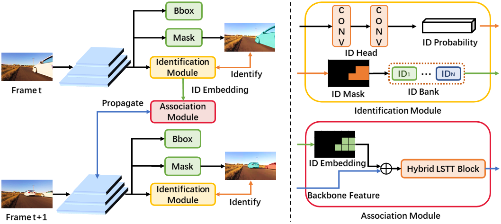

# Instance As Identity: A Generic Online Paradigm for Video Instance Segmentation

## Introduction
This repo is the evaluation code of IAI + CondInst model for video instance segmentation, and we will release training code later. The overview of IAI paradigm is shown below. 



## Prepare Environment
This repo is built on MMDetection-2.11, and it requires Python3 and PyTorch >= 1.5. This repo also relies on MMCV-1.3.8 & pycocotools-VIS-version, and you could install them by using following commands.
```
pip install git+https://github.com/youtubevos/cocoapi.git#"egg=pycocotools&subdirectory=PythonAPI"

pip install mmcv-full==1.3.8 -f https://download.openmmlab.com/mmcv/dist/{cu_version}/{torch_version}/index.html
```
When installing mmcv, you can set [cu_version} to cu92 or other version, {torch_version} to 1.5.0 or other version.
For example, if your environment is cuda 9.2 & torch 1.5.0, use 
```
pip install mmcv-full==1.3.8 -f https://download.openmmlab.com/mmcv/dist/cu92/1.5.0/index.html
```

## Prepare Dataset
1. Download YouTubeVIS from [here](https://youtube-vos.org/dataset/vis/).
2. Symlink the train/validation dataset to `data` folder. Put COCO-style annotations under `data/annotations`.
```
IAI
├── mmdet
├── tools
├── configs
├── data
│   ├── train
│   ├── val
│   ├── annotations
│   │   ├── instances_train_sub.json
│   │   ├── instances_val_sub.json
```

## Evaluation 
Download pretrained r50 model from [here](https://drive.google.com/file/d/1v6DJKjoiBvwO0jAR3fNTLfnpAP4ZaEh8/view?usp=sharing), and put it to `models/iai_condinst_r50.pth`

Run the following command to evaluate IAI + CondInst model with R50 backbone
```
sh run_r50.sh
```

Download pretrained r101 model from [here](https://drive.google.com/file/d/18tKT_b37CPaZL6AMaA5_sfOSzTnNxzsk/view?usp=sharing), and put it to `models/iai_condinst_r101.pth`

Run the following command to evaluate IAI + CondInst model with R101 backbone
```
sh run_r101.sh
```

A json file with the predicted result will be generated as ```output/results.json```. YouTubeVIS currently only allows evaluation on the codalab server. Please upload the generated result to [codalab server](https://competitions.codalab.org/competitions/20128) to see performance.
